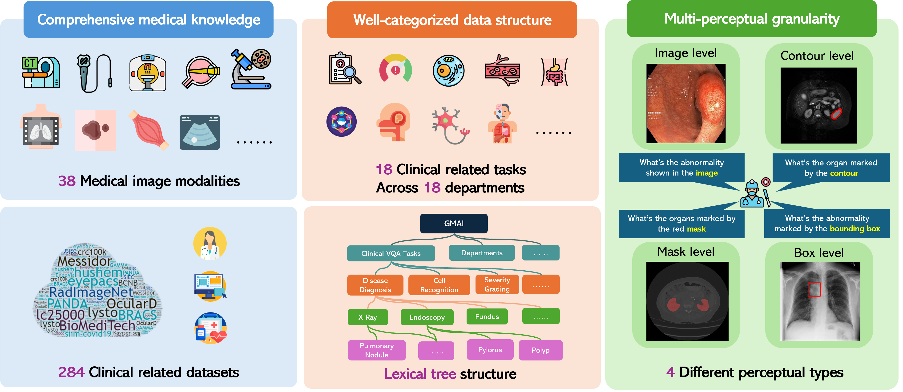
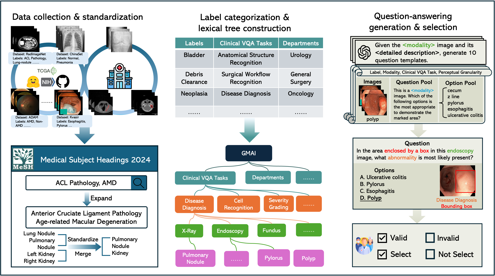
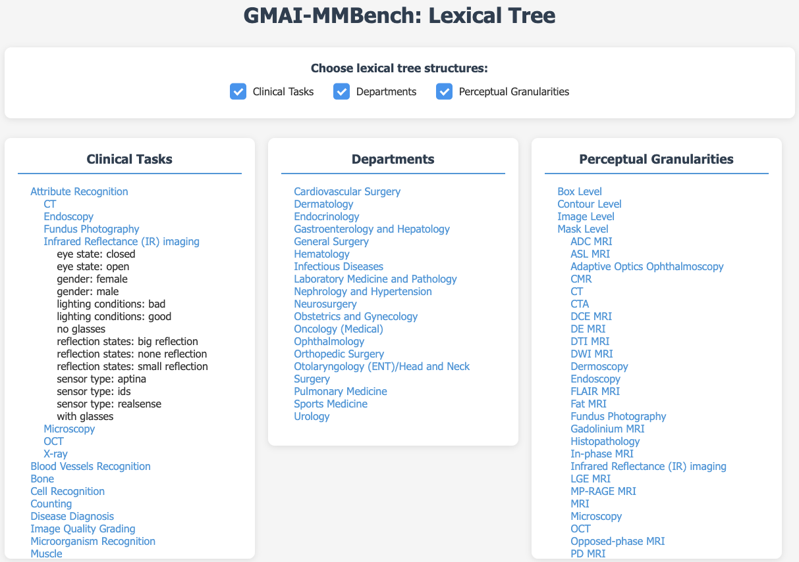

# <div align="center"><b> GMAI-MMBench </b></div>

[🍎 **Homepage**](https://uni-medical.github.io/GMAI-MMBench.github.io/#2023xtuner) | [**🤗 Dataset**](https://huggingface.co/datasets/myuniverse/GMAI-MMBench) | [**🤗 Paper**](https://huggingface.co/papers/2408.03361) | [**📖 arXiv**](https://arxiv.org/abs/2408.03361) | [**:octocat: GitHub**](https://github.com/uni-medical/GMAI-MMBench) | [**🌐 OpenDataLab**](https://opendatalab.com/GMAI/MMBench)

This repository is the official implementation of the paper **GMAI-MMBench: A Comprehensive Multimodal Evaluation Benchmark Towards General Medical AI**.

## 🌈 Update

- **🚀[2024-09-26]: Accepted by NeurIPS 2024 Datasets and Benchmarks Track!🌟**

## Overview

We introduce GMAI-MMBench: the most comprehensive general medical AI benchmark with well-categorized data structure and multi-perceptual granularity to date. It is constructed from **284 datasets** across **38 medical image modalities**, **18 clinical-related tasks**, **18 departments**, and **4 perceptual granularities** in a Visual Question Answering (VQA) format. Additionally, we implemented a **lexical tree** structure that allows users to customize evaluation tasks, accommodating various assessment needs and substantially supporting medical AI research and applications. We evaluated 50 LVLMs, and the results show that even the advanced GPT-4o only achieves an accuracy of 53.53\%, indicating significant room for improvement. We believe GMAI-MMBench will stimulate the community to build the next generation of LVLMs toward GMAI.


## 🚗Tutorial
This project is built upon **VLMEvalKit**. To get started:

1. Visit the [VLMEvalKit Quickstart Guide](https://github.com/open-compass/VLMEvalKit/blob/main/docs/en/get_started/Quickstart.md) for installation instructions. or you can run the following command for a quick start:
```bash
git clone https://github.com/open-compass/VLMEvalKit.git
cd VLMEvalKit
pip install -e .
```
**Supported models can be found in** [supported models](https://github.com/open-compass/VLMEvalKit/blob/main/vlmeval/config.py)

**VLM Configuration**: All VLMs are configured in `vlmeval/config.py`, for some VLMs, you need to configure the code root (MiniGPT-4, PandaGPT, etc.) or the model_weight root (LLaVA-v1-7B, etc.) before conducting the evaluation. During evaluation, you should use the model name specified in `supported_VLM` in `vlmeval/config.py` to select the VLM. For MiniGPT-4 and InstructBLIP, you also need to modify the config files in `vlmeval/vlm/misc` to configure LLM path and ckpt path.

Following VLMs require the configuration step:

**Code Preparation & Installation**: InstructBLIP ([LAVIS](https://github.com/salesforce/LAVIS)), LLaVA ([LLaVA](https://github.com/haotian-liu/LLaVA)), MiniGPT-4 ([MiniGPT-4](https://github.com/Vision-CAIR/MiniGPT-4)), mPLUG-Owl2 ([mPLUG-Owl2](https://github.com/X-PLUG/mPLUG-Owl/tree/main/mPLUG-Owl2)), OpenFlamingo-v2 ([OpenFlamingo](https://github.com/mlfoundations/open_flamingo)), PandaGPT-13B ([PandaGPT](https://github.com/yxuansu/PandaGPT)), TransCore-M ([TransCore-M](https://github.com/PCIResearch/TransCore-M)).

**Manual Weight Preparation & Configuration**: InstructBLIP, LLaVA-v1-7B, MiniGPT-4, PandaGPT-13B

You can run the evaluation using either `python` or `torchrun`. Here are some examples:

```bash
# When running with `python`, only one VLM instance is instantiated, and it might use multiple GPUs (depending on its default behavior).
# That is recommended for evaluating very large VLMs (like IDEFICS-80B-Instruct).

# IDEFICS-80B-Instruct on GMAI-MMBench_VAL, Inference and Evalution
python run.py --data GMAI-MMBench_VAL --model idefics_80b_instruct --verbose

# IDEFICS-80B-Instruct on GMAI-MMBench_VAL, Inference only
python run.py --data GMAI-MMBench_VAL --model idefics_80b_instruct --verbose --mode infer

# When running with `torchrun`, one VLM instance is instantiated on each GPU. It can speed up the inference.
# However, that is only suitable for VLMs that consume small amounts of GPU memory.

# IDEFICS-9B-Instruct, Qwen-VL-Chat, mPLUG-Owl2 on GMAI-MMBench_VAL. On a node with 8 GPU. Inference and Evaluation.
torchrun --nproc-per-node=8 run.py --data GMAI-MMBench_VAL --model idefics_80b_instruct qwen_chat mPLUG-Owl2 --verbose

# Qwen-VL-Chat on GMAI-MMBench_VAL. On a node with 2 GPU. Inference and Evaluation.
torchrun --nproc-per-node=2 run.py --data GMAI-MMBench_VAL --model qwen_chat --verbose
```
The evaluation results will be printed as logs, besides. **Result Files** will also be generated in the directory `$YOUR_WORKING_DIRECTORY/{model_name}`. Files ending with `.csv` contain the evaluated metrics.

## Implement your model for benchmarking.
Please follow the installation on [developer guide](https://github.com/open-compass/VLMEvalKit/blob/main/docs/en/advanced_guides/Development.md) to implement your model for **GMAI-MMBench**

## To render an image into visualization.
To facilitate users in testing benchmarks with VLMEvalKit, we have stored our data directly in TSV format, requiring no additional operations to use our benchmark seamlessly with this tool. To prevent data leakage, we have included an "answer" column in the VAL data, while removing the "answer" column from the Test data.
For the "image" column, we have used Base64 encoding (to comply with [VLMEvalKit](https://github.com/open-compass/VLMEvalKit)'s requirements). The encryption code is as follows:
```python
image = cv2.imread(image_path, cv2.IMREAD_COLOR)
encoded_image = encode_image_to_base64(image)

def encode_image_to_base64(image):
    """Convert image to base64 string."""
    _, buffer = cv2.imencode('.png', image)
    return base64.b64encode(buffer).decode()
```
The code for converting the Base64 format back into an image can be referenced from the official [VLMEvalKit](https://github.com/open-compass/VLMEvalKit):
```python
def decode_base64_to_image(base64_string, target_size=-1):
    image_data = base64.b64decode(base64_string)
    image = Image.open(io.BytesIO(image_data))
    if image.mode in ('RGBA', 'P'):
        image = image.convert('RGB')
    if target_size > 0:
        image.thumbnail((target_size, target_size))
    return image
```
If needed, below is the official code provided by [VLMEvalKit](https://github.com/open-compass/VLMEvalKit) for converting an image to Base64 encoding:
```python
def encode_image_to_base64(img, target_size=-1):
    # if target_size == -1, will not do resizing
    # else, will set the max_size ot (target_size, target_size)
    if img.mode in ('RGBA', 'P'):
        img = img.convert('RGB')
    if target_size > 0:
        img.thumbnail((target_size, target_size))
    img_buffer = io.BytesIO()
    img.save(img_buffer, format='JPEG')
    image_data = img_buffer.getvalue()
    ret = base64.b64encode(image_data).decode('utf-8')
    return ret


def encode_image_file_to_base64(image_path, target_size=-1):
    image = Image.open(image_path)
    return encode_image_to_base64(image, target_size=target_size)
```

## Benchmark Creation

GMAI-MMBench is constructed from 284 datasets across 38 medical image modalities. These datasets are derived from the public (268) and several hospitals (16) that have agreed to share their ethically approved data. The data collection can be divided into three main steps: 
1) We search hundreds of datasets from both the public and hospitals, then keep 284 datasets with highly qualified labels after dataset filtering, uniforming image format, and standardizing label expression.
2) We categorize all labels into 18 clinical VQA tasks and 18 clinical departments, then export a lexical tree for easily customized evaluation.
3) We generate QA pairs for each label from its corresponding question and option pool. Each question must include information about image modality, task cue, and corresponding annotation granularity.
The final benchmark is obtained through additional validation and manual selection.



## Lexical Tree

In this work, to make the GMAI-MMBench more intuitive and user-friendly, we have systematized our labels and structured the entire dataset into a lexical tree. Users can freely select the test contents based on this lexical tree. We believe that this customizable benchmark will effectively guide the improvement of models in specific areas.

<!--  -->


You can see the complete lexical tree at [**🍎 Homepage**](https://uni-medical.github.io/GMAI-MMBench.github.io/#2023xtuner).

## Evaluation

Please refer to our huggingface [**🤗 Dataset**](https://huggingface.co/datasets/myuniverse/GMAI-MMBench) for more details.

## 🏆 Leaderboard

| Rank | Model Name                | Val   | Test  |
|:----:|:-------------------------:|:-----:|:-----:|
|      | Random                    | 25.70 | 25.94 |
|  1   | GPT-4o                    | 53.53 | 53.96 |
|  2   | Gemini 1.5                | 47.42 | 48.36 |
|  3   | Gemini 1.0                | 44.38 | 44.93 |
|  4   | GPT-4V                    | 42.50 | 44.08 |
|  5   | MedDr                     | 41.95 | 43.69 |
|  6   | MiniCPM-V2                | 41.79 | 42.54 |
|  7   | DeepSeek-VL-7B            | 41.73 | 43.43 |
|  8   | Qwen-VL-Max               | 41.34 | 42.16 |
|  9   | LLAVA-InternLM2-7b        | 40.07 | 40.45 |
| 10   | InternVL-Chat-V1.5        | 38.86 | 39.73 |
| 11   | TransCore-M               | 38.86 | 38.70 |
| 12   | XComposer2                | 38.68 | 39.20 |
| 13   | LLAVA-V1.5-7B             | 38.23 | 37.96 |
| 14   | OmniLMM-12B               | 37.89 | 39.30 |
| 15   | Emu2-Chat                 | 36.50 | 37.59 |
| 16   | mPLUG-Owl2                | 35.62 | 36.21 |
| 17   | CogVLM-Chat               | 35.23 | 36.08 |
| 18   | Qwen-VL-Chat              | 35.07 | 36.96 |
| 19   | Yi-VL-6B                  | 34.82 | 34.31 |
| 20   | Claude3-Opus              | 32.37 | 32.44 |
| 21   | MMAlaya                   | 32.19 | 32.30 |
| 22   | Mini-Gemini-7B            | 32.17 | 31.09 |
| 23   | InstructBLIP-7B           | 31.80 | 30.95 |
| 24   | Idelecs-9B-Instruct       | 29.74 | 31.13 |
| 25   | VisualGLM-6B              | 29.58 | 30.45 |
| 26   | RadFM                     | 22.95 | 22.93 |
| 27   | Qilin-Med-VL-Chat         | 22.34 | 22.06 |
| 28   | LLaVA-Med                 | 20.54 | 19.60 |
| 29   | Med-Flamingo              | 12.74 | 11.64 |

## Disclaimers

The guidelines for the annotators emphasized strict compliance with copyright and licensing rules from the initial data source, specifically avoiding materials from websites that forbid copying and redistribution.
Should you encounter any data samples potentially breaching the copyright or licensing regulations of any site, we encourage you to contact us. Upon verification, such samples will be promptly removed.

## Contact

- Jin Ye: jin.ye@monash.edu
- Junjun He: hejunjun@pjlab.org.cn
- Qiao Yu: qiaoyu@pjlab.org.cn

## Citation

**BibTeX:**

```bibtex
@misc{chen2024gmaimmbenchcomprehensivemultimodalevaluation,
      title={GMAI-MMBench: A Comprehensive Multimodal Evaluation Benchmark Towards General Medical AI}, 
      author={Pengcheng Chen and Jin Ye and Guoan Wang and Yanjun Li and Zhongying Deng and Wei Li and Tianbin Li and Haodong Duan and Ziyan Huang and Yanzhou Su and Benyou Wang and Shaoting Zhang and Bin Fu and Jianfei Cai and Bohan Zhuang and Eric J Seibel and Junjun He and Yu Qiao},
      year={2024},
      eprint={2408.03361},
      archivePrefix={arXiv},
      primaryClass={eess.IV},
      url={https://arxiv.org/abs/2408.03361}, 
}
```
