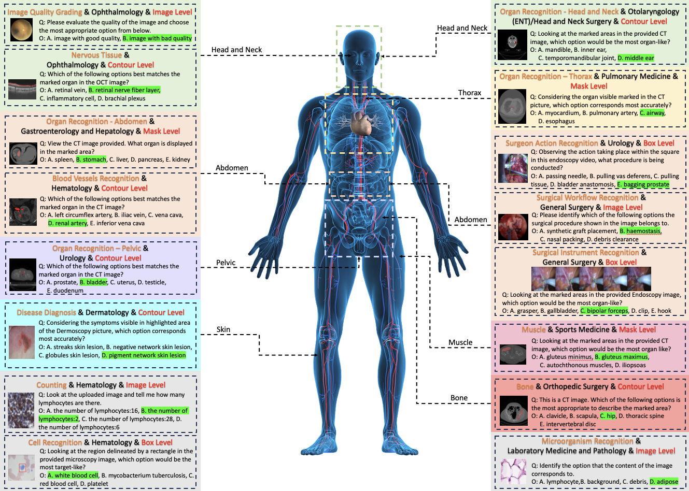

# <div align="center"><b> GMAI-MMBench </b></div>

[🍎 **Homepage**](https://uni-medical.github.io/GMAI-MMBench.github.io/#2023xtuner) | [**🤗 Dataset**](https://huggingface.co/datasets/myuniverse/GMAI-MMBench) | [**📖 arXiv**]() | [**:octocat: GitHub**](https://github.com/uni-medical/GMAI-MMBench) | [**🌐 OpenDataLab**](https://opendatalab.com/GMAI/MMBench)

This repository is the official implementation of the paper **GMAI-MMBench: A Comprehensive Multimodal Evaluation Benchmark Towards General Medical AI**.

## 🌈 Update

- **🔥 [2024-06-05]: Submit on NeurIPS2024! 🌟**

## Overview

We introduce GMAI-MMBench: the most comprehensive general medical AI benchmark with well-categorized data structure and multi-perceptual granularity to date. It is constructed from **285 datasets** across **38 medical image modalities**, **19 clinical-related tasks**, **18 departments**, and **4 perceptual granularities** in a Visual Question Answering (VQA) format. Additionally, we implemented a **lexical tree** structure that allows users to customize evaluation tasks, accommodating various assessment needs and substantially supporting medical AI research and applications. We evaluated 50 LVLMs, and the results show that even the advanced GPT-4o only achieves an accuracy of 52\%, indicating significant room for improvement. We believe GMAI-MMBench will stimulate the community to build the next generation of LVLMs toward GMAI.


## Benchmark Creation

GMAI-MMBench is constructed from 285 datasets across 38 medical image modalities. These datasets are derived from the public (268) and several hospitals (17) that have agreed to share their ethically approved data. The data collection can be divided into three main steps: 
1) We search hundreds of datasets from both the public and hospitals, then keep 285 datasets with highly qualified labels after dataset filtering, uniforming image format, and standardizing label expression.
2) We categorize all labels into 19 clinical VQA tasks and 18 clinical departments, then export a lexical tree for easily customized evaluation.
3) We generate QA pairs for each label from its corresponding question and option pool. Each question must include information about image modality, task cue, and corresponding annotation granularity.
The final benchmark is obtained through additional validation and manual selection.


## Lexical Tree

In this work, to make the GMAI-MMBench more intuitive and user-friendly, we have systematized our labels and structured the entire dataset into a lexical tree. Users can freely select the test contents based on this lexical tree. We believe that this customizable benchmark will effectively guide the improvement of models in specific areas.

<!--  -->


You can see the complete lexical tree at [**🍎 Homepage**](https://uni-medical.github.io/GMAI-MMBench.github.io/#2023xtuner).

## Evaluation

Please refer to our huggingface [**🤗 Dataset**](https://huggingface.co/datasets/myuniverse/GMAI-MMBench) for more details.

## 🏆 Leaderboard

| Rank | Model Name                | Val   | Test  |
|:----:|:-------------------------:|:-----:|:-----:|
|      | Random                    | 25.70 | 25.94 |
| 1    | GPT-4o                    | 53.53 | 53.96 |
| 2    | Gemini 1.5                | 47.42 | 48.36 |
| 3    | Gemini 1.0                | 44.48 | 44.93 |
| 4    | GPT-4V                    | 42.50 | 44.33 |
| 5    | Qwen-VL-Max               | 41.34 | 41.96 |
| 6    | MedDr                     | 41.95 | 43.69 |
| 7    | MiniCPM-V2                | 41.79 | 42.54 |
| 8    | DeepSeek-VL-7B            | 41.73 | 43.43 |
| 9    | LLAVA-InternLM2-7b        | 40.07 | 40.45 |
| 10   | InternVL-Chat-V1.5        | 38.86 | 39.79 |
| 11   | TransCore-M               | 38.60 | 39.20 |
| 12   | XComposer2                | 38.68 | 39.20 |
| 13   | LLAVA-V1.5-7B             | 38.23 | 37.96 |
| 14   | OmniLMM-12B               | 37.89 | 39.09 |
| 15   | Emu2-Chat                 | 37.86 | 37.93 |
| 16   | mPLUG-Owl2                | 35.62 | 36.51 |
| 17   | CogVLM-Chat               | 35.23 | 36.08 |
| 18   | Qwen-VL-Chat              | 35.07 | 37.08 |
| 19   | Yi-VL-6B                  | 34.82 | 34.31 |
| 20   | Claude3-Opus              | 32.37 | 32.44 |
| 21   | MMAlaya                   | 32.19 | 32.30 |
| 22   | Mini-Gemini-7B            | 32.11 | 32.13 |
| 23   | InstructBLIP-7B           | 31.80 | 30.95 |
| 24   | Idelecs-9B-Instruct       | 29.74 | 31.13 |
| 25   | VisualGLM-6B              | 29.58 | 30.45 |
| 26   | RadFM                     | 22.95 | 23.06 |
| 27   | Qilin-Med-VL-Chat         | 22.34 | 22.06 |
| 28   | LLaVA-Med                 | 20.54 | 19.60 |
| 29   | Med-Flamingo              | 12.74 | 11.64 |

## Disclaimers

The guidelines for the annotators emphasized strict compliance with copyright and licensing rules from the initial data source, specifically avoiding materials from websites that forbid copying and redistribution.
Should you encounter any data samples potentially breaching the copyright or licensing regulations of any site, we encourage you to [contact](#contact) us. Upon verification, such samples will be promptly removed.

## Contact

- Jin Ye: jin.ye@monash.edu
- Junjun He: hejunjun@pjlab.org.cn
- Qiao Yu: qiaoyu@pjlab.org.cn

## Citation

**BibTeX:**

```bibtex

```
